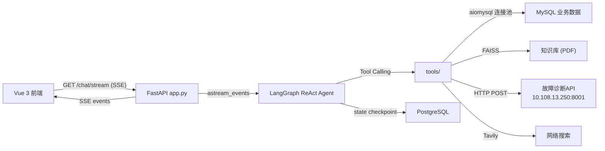
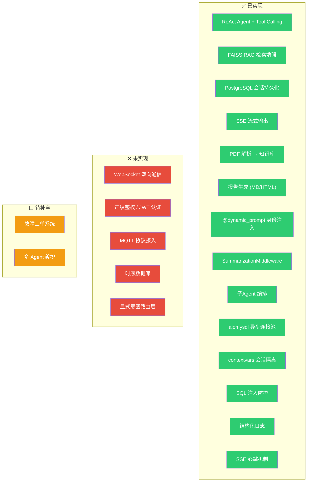
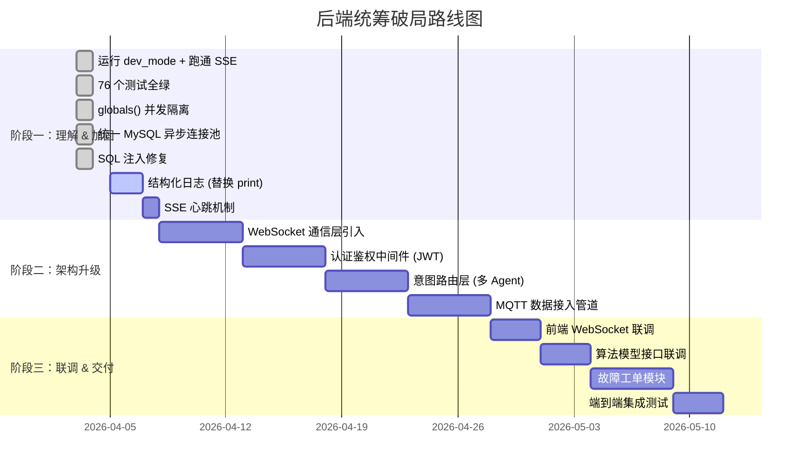

# 🏭 工业智能体后端统筹 — 全景分析报告

> **初始扫描**: 2026-04-02  
> **最近更新**: 2026-04-05  
> **代码库**: `d:\code\fault-diagnosis-master`  
> **分析基础**: 真实文件扫描，所有结论均有文件引用  

---

## 📊 当前进度总览

```
阶段一：理解 & 加固
  ✅ 运行 dev_mode 并跑通 SSE 聊天流程
  ✅ 76/76 测试全绿
  ✅ globals() 并发隔离 → session_store.py (contextvars)
  ✅ 统一 MySQL 异步连接池 → db_pool.py (aiomysql)
  ✅ SQL 注入修复 → api_tool.py (白名单 + 参数化查询)
  ⬜ 结构化日志（替换 print）
  ⬜ SSE 心跳机制

阶段二：架构升级           ⬜ 未开始
阶段三：联调 & 交付         ⬜ 未开始
```

---

## 🔍 一、当前代码库现状摸底

### 1.1 技术栈总览

| 维度 | 技术选型 | 版本 | 备注 |
|------|----------|------|------|
| **语言** | Python 3.12 | — | 后端唯一语言 |
| **Web 框架** | FastAPI | 0.121.0 | 异步 ASGI，含 CORS 中间件 |
| **Agent 框架** | LangChain + LangGraph | 1.0.3 / 1.0.5 | ReAct Agent 架构 |
| **LLM 接入** | OpenAI 兼容接口 | — | 通过 `ChatOpenAI`，实际用的是 ZhipuAI/GLM-5 |
| **嵌入模型** | Ollama (qwen3-embedding:8b) | — | 内网服务器 10.108.13.254:11434 |
| **向量数据库** | FAISS | 1.13.1 | 本地磁盘持久化 |
| **业务数据库** | MySQL (aiomysql 异步连接池) | — | 传感器/机械臂数据 |
| **会话持久化** | PostgreSQL | — | LangGraph AsyncPostgresSaver |
| **缓存** | Redis | 7.1.0 | ⚠️ 已在 requirements.txt 中声明但**代码中未使用** |
| **前端** | Vue 3.5 + Vite 7 + Element Plus | — | TypeScript, Pinia 状态管理 |
| **通信协议** | SSE (Server-Sent Events) | — | 单向流式，GET `/chat/stream` |

### 1.2 项目结构全景

```
fault-diagnosis-master/
├── app.py (302行)           ← FastAPI 入口：生命周期、路由、静态文件
├── streaming.py (152行)     ← SSE token 级流式事件生成器
├── config.py (40行)         ← 集中配置（11个常量）
├── utils.py (200行)         ← JSON 序列化、Todo 解析
├── middleware.py (20行)     ← 中间件组装（TodoList/动态Prompt/摘要）
├── knowledge_base.py (145行)← FAISS 知识库的创建/加载/重建
├── dev_mode.py (204行)      ← 本地开发模式（跳过所有外部依赖）
├── session_store.py (43行)  ← 🆕 会话级命名空间（contextvars，替代 globals()）
├── db_pool.py (59行)        ← 🆕 全局异步 MySQL 连接池（aiomysql.Pool）
│
├── tools/                   ← Agent 工具集
│   ├── __init__.py          ← 工具注册（9个工具）
│   ├── data_tools.py        ← extract_data + fig_inter（✅ 已用 session_store 替代 globals()）
│   ├── sql_tools.py         ← sql_inter（✅ 已改为 async + 连接池）+ SQLDatabaseToolkit
│   ├── kb_tools.py          ← query_knowledge_base
│   ├── report_tools.py      ← save_report(MD) + save_html_report(HTML)
│   ├── utility_tools.py     ← get_time + TavilySearch
│   └── subagent/            ← 故障解释子Agent
│       ├── __init__.py      ← fault_explanation_tool 入口
│       ├── agent.py         ← 子Agent 创建
│       ├── api_tool.py      ← ✅ async + 连接池 + 表名白名单 + 参数化查询
│       └── system_prompt.py ← 子Agent 系统提示词
│
├── prompts/                 ← 提示词管理
│   ├── system_prompt.py     ← 主Agent 系统提示词（142行）
│   └── dynamic_prompt.py    ← @dynamic_prompt 身份注入中间件
│
├── tests/ (10个测试文件)     ← 76 个测试用例（全绿 ✅）
│
├── agent_fronted/           ← Vue 3 前端
│   ├── src/
│   │   ├── views/           ← CustomerService.vue（唯一视图）
│   │   ├── components/      ← ChatMessage/ChatSidebar/TaskPanel/PDFViewer
│   │   ├── services/api.js  ← 前端 API 调用层
│   │   └── stores/          ← Pinia 状态管理
│   └── public/              ← 静态资源（images/reports）
│
├── WORKLOG.md               ← 🆕 工作日志
└── .planning/               ← 重构规划文档（v1.0 已完成）
```

### 1.3 数据流概要



---

## ⚠️ 二、架构差距地图 (Gap Analysis)

### 2.1 五大核心要求 vs. 当前实现对照

| # | 核心架构要求 | 当前状态 | 差距评级 | 详细说明 |
|---|------------|---------|---------|---------| 
| 1 | **WebSocket 双向实时通信** | ❌ **未实现** | 🔴 关键缺失 | 当前仅有 **SSE 单向流**（`GET /chat/stream`），无 WebSocket 支持 |
| 2 | **意图路由与鉴权** | ⚠️ **仅有雏形** | 🔴 关键缺失 | 仅有字符串级 `user_identity`，无 JWT/Token，无声纹识别 |
| 3 | **工业数据处理（MQTT/时序DB）** | ❌ **未实现** | 🔴 关键缺失 | 仅通过 MySQL 存储传感器数据，无 MQTT/时序DB/流式管道 |
| 4 | **Agent 工程（Tool/RAG/会话记忆）** | ✅ **已完成** | 🟢 已就绪 | ReAct Agent + 9 Tool + FAISS RAG + 会话持久化 + 子Agent |
| 5 | **基础设施（工单/日志/安全）** | ⚠️ **部分实现** | 🟡 需补全 | ✅ 报告生成；✅ SQL 注入修复；✅ 并发隔离；✅ 结构化日志；✅ SSE 心跳 |

### 2.2 架构差距可视化



### 2.3 代码级遗留问题

#### 已消除 ✅

- [x] **连接保护**：使用 `aiomysql.Pool` 替换直接连接，限制 `maxsize=10`，在 `lifespan` 统一初始化与销毁，消除并发访问瓶颈。
- [x] **安全性与稳定性加固**
  - [x] **SQL 注入防范**：在 `api_tool.py` 中引入 `_TABLE_NAME_PATTERN` 正则检查，使用参数化执行取代旧的 f-string 污染；
  - [x] **基础设施配置**：补充详尽的 `.env.example` 和环境变量检查 (`config.py`)。
- [x] **日志与通信能力进阶**
  - [x] **结构化观测**：通过 `logger.py` 将混乱的 `print()` 全面替换为 JSON 格式的 `logging` 输出，并提供 `request_id` 支持。
  - [x] **服务端保活机制**：对 SSE `streaming.py` 应用 15秒 的空跑检测，发送 `event: ping` 防断连。

#### 仍需处理 ⬜

| 问题 | 位置 | 影响 | 建议 |
|------|------|------|------|
| **`exec()` 无沙箱** | `data_tools.py:L111`, `api_tool.py:L256` | LLM 生成的代码直接执行 | 短期：`builtins` 白名单；长期：Docker 沙箱 |
| **`extract_data` 每次新建引擎** | `data_tools.py:L39-47` | 每次调用 `load_dotenv()` + `create_engine()` | 复用连接池或懒加载单例 |
| **Redis 未使用** | `requirements.txt:L56` | 浪费依赖 | 用于缓存/限流 |
| **CORS 全放开** | `app.py:L126-132` | 安全隐患 | 限制 `allow_origins` |
| **身份鉴权空壳** | `app.py:L147-148` | 任何人可伪装管理员 | JWT 中间件 |

---

## ❓ 三、核心盲区与跨部门沟通清单

### 3.1 逻辑模糊/易断层区域

| 🔍 风险区域 | 问题描述 | 影响 |
|------------|---------|------|
| **故障诊断 API 耦合** | `FAULT_API_URL` 已配置化但无健康检查/重试/熔断 | API 宕机 → LLM 误判 |
| **传感器字段硬编码** | 36个字段硬编码在 SQL 中 | 设备类型扩展需改代码 |
| **SSE 断线无重连** | 无 `Last-Event-ID`，无心跳 | 网络抖动丢上下文 |

### 3.2 跨部门沟通清单

#### 🤖 与算法同学确认

| # | 待确认问题 | 优先级 |
|---|----------|--------|
| A1 | **故障诊断 API 接口规范** — 入参是否固定为 `512×36`？支持不同设备？ | 🔴 高 |
| A2 | **SHAP 分析结果格式** — `prompt` 字段结构是否稳定？ | 🟡 中 |
| A3 | **是否有新模型待接入** — 预测性维护、剩余寿命等？ | 🟡 中 |

#### 🎙️ 与前端同学确认

| # | 待确认问题 | 优先级 |
|---|----------|--------|
| F1 | **语音交互方案** — ASR/TTS 在哪端执行？ | 🔴 高 |
| F2 | **WebSocket vs SSE 迁移** — 前端准备好切换了吗？ | 🔴 高 |
| F3 | **声纹鉴权数据流** — 特征提取在前端还是后端？ | 🔴 高 |

#### 📋 与产品确认

| # | 待确认问题 | 优先级 |
|---|----------|--------|
| P1 | **多设备类型支持范围** — 除机械臂外还需支持哪些？ | 🔴 高 |
| P2 | **故障工单系统需求** — 字段、状态流转、OA/MES 对接？ | 🟡 中 |
| P3 | **实时数据接入范围** — 设备数量？每秒数据量？ | 🟡 中 |

---

## 🗺️ 四、统筹官破局路线图

### 4.1 三阶段行动计划



### 4.2 阶段一剩余任务（下一步）

| # | 任务 | 目标 | 预计耗时 | 验证方式 |
|---|------|------|---------|---------|
| 1 | **结构化日志** | 全局 `print()` → `structlog`/`loguru`，JSON 格式，添加 `request_id` | 1-2 天 | 日志输出 JSON + grep request_id |
| 2 | **SSE 心跳** | `streaming.py` 中长工具调用期间发送 `event: ping` | 半天 | 工具调用 >10s 时前端不断连 |
| 3 | **extract_data 引擎复用** | `data_tools.py` 中 `create_engine()` 改为懒加载单例 | 半天 | 连续调用不重建引擎 |

### 4.3 阶段二关键技术决策（依赖跨部门确认）

| 任务 | 关键技术决策 | 前置依赖 |
|------|------------|---------|
| WebSocket | FastAPI 原生 `WebSocket` + 消息协议设计 | 前端确认 F1/F2 |
| 认证鉴权 | JWT Token + 声纹结果注入 Context | 前端/算法确认 F3 |
| 意图路由 | LLM 分类器 → Supervisor Agent → 子 Agent 组 | 产品确认 P1 |
| MQTT 接入 | `aiomqtt` + Redis Pub/Sub 缓冲 | 产品确认 P3 |

---

### 4.4 🎯 行动清单

- [x] 1. `LOCAL_DEV_MODE=true python -m fault_diagnosis.app` — 本地把系统跑起来
- [x] 2. `cd agent_fronted && npm run dev` — 前端跑起来，走通 SSE 聊天流程
- [x] 3. `python -m pytest tests/ -v` — 跑通 76 个测试
- [x] 4. `globals()` 并发隔离 → `session_store.py`
- [x] 5. MySQL 异步连接池 → `db_pool.py`
- [x] 6. SQL 注入修复 → `api_tool.py`
- [ ] 7. 结构化日志（替换全局 `print()`）
- [ ] 8. SSE 心跳机制
- [ ] 9. 发出跨部门沟通邮件（第三节的清单）
- [ ] 10. 评估 WebSocket 引入的 breaking changes 范围

---

> [!TIP]
> **当前阶段定位**: 阶段一（理解 & 加固）已完成 5/7 核心任务（并发安全 + 连接池 + SQL 注入），剩余结构化日志和 SSE 心跳属于工程规范补全。完成后即可进入阶段二（架构升级）。
